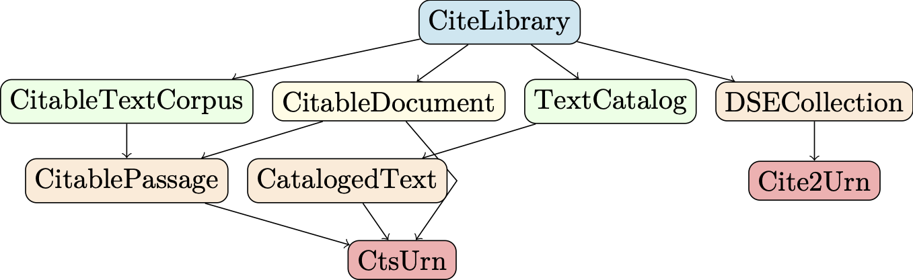

# modulegraph

> Visualize types representing key concepts of the CITE architecture and Julia packages related to the CITE architecture as graphs.


## Generate PDFs

Requires Julia 1.7.  Set `project` parameter to point to this directory.


Generate graph of CITE concepts and color key:

```
julia --project=. cite.jl
julia --project=. citecolorkey.jl
```


Generate graph of Julia modules and color key:

```
julia --project=. modules.jl
julia --project=. modulescolorkey.jl
```

## Output (converted to PNG format)

Images on this page are embedded to full-size PNGs.

### Julia types for CITE concepts

[](graphs/cite-concepts.png)

> color key:
>
> [](graphs/concepts-colorkey.png)


### Julia packages


[](graphs/packages.png)

> color key:
>
> [](graphs/packages-colorkey)

