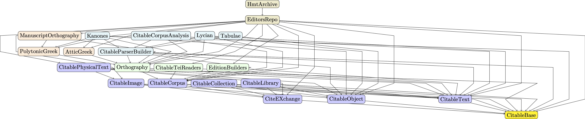

# Visualizing CITE in Julia

> Generate graph visualizations of Julia types representing key concepts of the CITE architecture, and of Julia packages related to the CITE architecture.

Images on this page are linked to full-size PNGs.

Directed edges indicate dependency.  For types, the dependency is conceptual; for packages, the dependency is a literal code dependency specified in `Project.toml`.

## Julia types for CITE concepts

[](graphs/cite-concepts.png)

> color key:
>
> [](graphs/concepts-colorkey.png)


## Julia packages


[](graphs/packages.png)

> color key:
>
> [](graphs/packages-colorkey)


## Generate PDFs

Requires Julia 1.7.  Set `project` parameter to point to the root directory of this repository.


Generate graph of Julia types for key CITE concepts and color key:

```
julia --project=. concepts.jl
julia --project=. concepts-colorkey.jl
```


Generate graph of Julia modules and color key:

```
julia --project=. packages.jl
julia --project=. packages-colorkey.jl
```